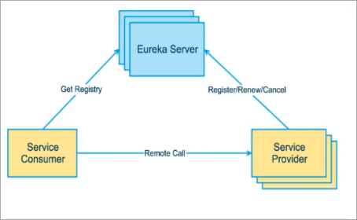

# Spring  Cloud

Eureka包含两个组件 Eureka Server 和 Eureka Client
------------------------------------------

Eureka Server提供服务注册服务

各个微服务节点通过配置启动后，会在EurekaServer中进行注册，这样EurekaServer中的服务注册表将会存储所有可用服务节点的信息，服务节点的信息可以在页面中直观看到。

Eureka Client通过注册中心进行访问

是一个Java客户端，用于简化Eureka
Server的交互，客户端同事也具备一个内置的、使用轮询(round-robin)负载算法的负载均衡器。在应用启动后，将会向Server发送心跳(默认周期为30秒)。如果EurekaServer在多个心跳周期内没有接收到某个节点的心跳，EurekaServer将会从服务注册表中把这个服务节点删除（默认90秒）

Eureka集群原理
----------

Eureka Server
- 服务注册：将服务信息注册进注册中心
- 服务发现：从注册中心上获取服务信息
- 实质：存Key服务名 取value调用地址

Eureka Client
1. 先启动eureka注册中心
2. 启动服务提供者payment支付服务
3. 支付服务启动后会把自身信息(比如服务地址以别名方式注册进eureka)
4. 消费者order服务在需要调用接口时，使用服务别名去注册中心获取实际的RPC远程调用地址
5. 消费者获取调用地址后，底层实际是利用HTTPClient技术实现远程调用。
6. 消费者获取服务地址后会缓存在本地JVM内存中，默认每间隔30秒

